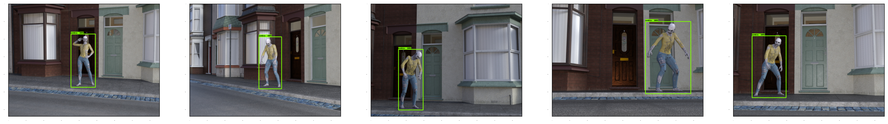
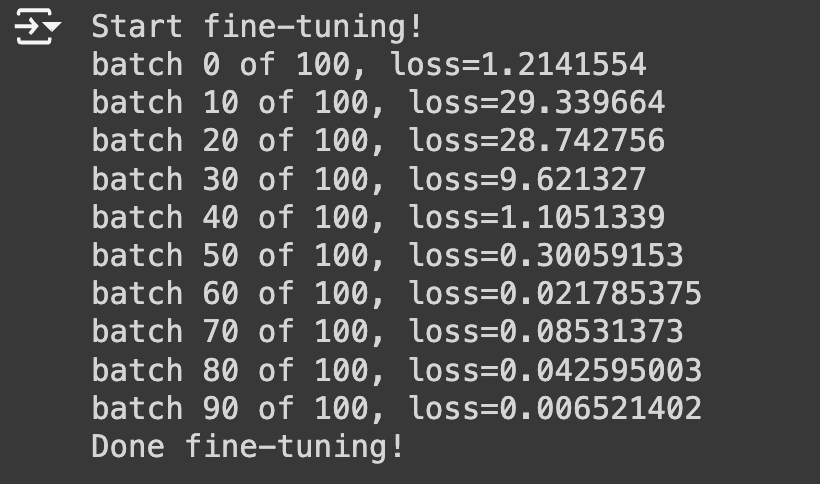

# Zombie-Detection

In this repository, we utilize the `Object Detection API` and retrain `RetinaNet` to detect zombies using only 5 training images. The model is set up to restore pretrained weights and fine-tune the classification layers.

## Training Samples
Below are the five training samples used:

# Fined-tuned Model

We reuse the following components of RetinaNet:

- Feature extraction layers
- Bounding box regression prediction layer

However, we define and train a new classification layer specifically for detecting zombies, rather than reusing the existing classification prediction layer.

# Loss Trend

The loss is computed by considering both the classification loss and the bounding box prediction loss. The model's loss converges to less than 0.01 after 100 batches of training.

# Prediction Results

To test the performance of the fine-tuned model, we used a series of 237 zombie walking frames.

